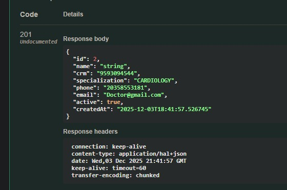

# HealthScheduler API

Sistema completo de agendamento de consultas médicas desenvolvido com Spring Boot, oferecendo uma API RESTful robusta para gerenciamento de médicos, pacientes, consultas e agendas médicas.

## 📋 Índice

- [Tecnologias](#-tecnologias)
- [Funcionalidades](#-funcionalidades)
- [Pré-requisitos](#-pré-requisitos)
- [Instalação e Configuração](#-instalação-e-configuração)
- [Documentação da API](#-documentação-da-api)
- [Endpoints Principais](#-endpoints-principais)
- [Regras de Negócio](#-regras-de-negócio)
- [Validações](#-validações)
- [Tratamento de Erros](#-tratamento-de-erros)
- [Testes](#-testes)
- [Arquitetura](#-arquitetura)
- [Build e Deploy](#-build-e-deploy)
- [Contribuindo](#-contribuindo)

---

## 🚀 Tecnologias

| Tecnologia | Versão | Descrição |
|-----------|--------|-----------|
| Java | 17 | Linguagem de programação |
| Spring Boot | 3.3.3 | Framework principal |
| Spring Data JPA | 3.x | Persistência de dados |
| Spring HATEOAS | 3.x | Links hipermídia |
| PostgreSQL | Latest | Banco de dados (produção) |
| H2 Database | Latest | Banco de dados (testes) |
| ModelMapper | Latest | Mapeamento DTO ↔ Entity |
| Lombok | Latest | Redução de boilerplate |
| Bean Validation | 3.x | Validação de dados |
| Swagger/OpenAPI | 3.0 | Documentação interativa |
| JUnit 5 | Latest | Framework de testes |
| Mockito | Latest | Mocking para testes unitários |
| Maven | 3.6+ | Gerenciamento de dependências |

---

## ✨ Funcionalidades

### 👨‍⚕️ Gestão de Médicos
- ✅ Cadastro com validação de CRM único
- ✅ Listagem paginada de médicos ativos
- ✅ Busca por ID e especialização
- ✅ Atualização de dados (nome, telefone, email)
- ✅ Ativação/Desativação com proteção contra consultas futuras
- ✅ Links HATEOAS para navegação entre recursos

### 👥 Gestão de Pacientes
- ✅ Cadastro com validação de CPF, telefone e email únicos
- ✅ CRUD completo com paginação
- ✅ Cálculo automático de idade
- ✅ Gerenciamento de endereço completo
- ✅ Validação de dados pessoais

### 📅 Gestão de Consultas
- ✅ Agendamento com validações rigorosas de horário
- ✅ Listagem por paciente, médico ou status
- ✅ Confirmação de consultas agendadas
- ✅ Controle de ciclo de vida (Agendado → Confirmado → Concluído/Cancelado)
- ✅ Validação de horário comercial e dias úteis
- ✅ Controle de concorrência otimista (@Version)

### 🕐 Gestão de Agenda Médica
- ✅ Configuração de horários semanais
- ✅ Suporte a múltiplos turnos por dia
- ✅ Validação de horários (início < fim)
- ✅ Substituição completa da agenda

---

## 📋 Pré-requisitos

- **JDK 17** ou superior instalado
- **Maven 3.6+** instalado
- **PostgreSQL 12+** (para produção)
- **Git** para clonar o repositório
- **IDE** recomendada: IntelliJ IDEA ou Eclipse

---

## ⚙️ Instalação e Configuração

### 1. Clone o Repositório

```bash
git clone https://github.com/KaykMurphy/HealthScheduler.git
cd HealthScheduler
```

### 2. Configure o Banco de Dados

#### Opção A: PostgreSQL (Produção)

Configure as variáveis de ambiente:

```bash
export DB_URL=jdbc:postgresql://localhost:5432/healthscheduler
export DB_USERNAME=seu_usuario
export DB_PASSWORD=sua_senha
```

Ou edite `src/main/resources/application.properties`:

```properties
spring.datasource.url=jdbc:postgresql://localhost:5432/healthscheduler
spring.datasource.username=seu_usuario
spring.datasource.password=sua_senha
spring.jpa.hibernate.ddl-auto=update
spring.datasource.driver-class-name=org.postgresql.Driver
```

#### Opção B: H2 (Desenvolvimento)

Para usar H2 em memória, adicione ao `application.properties`:

```properties
spring.datasource.url=jdbc:h2:mem:testdb
spring.datasource.driver-class-name=org.h2.Driver
spring.h2.console.enabled=true
spring.h2.console.path=/h2-console
```

### 3. Compile o Projeto

```bash
mvn clean install
```

### 4. Execute a Aplicação

```bash
mvn spring-boot:run
```

A aplicação estará disponível em: **http://localhost:8080**

---

## 📚 Documentação da API

A documentação interativa completa está disponível via **Swagger UI**:

```
http://localhost:8080/swagger-ui.html
```

### 📸 Exemplos Visuais

#### ✅ Sucesso - Cadastro de Médico (201 Created)

*Exemplo de resposta bem-sucedida ao cadastrar um médico*

#### ❌ Erro de Validação (400 Bad Request)

*Exemplo de erro quando os dados não atendem às regras de validação*

---

## 🔗 Endpoints Principais

### 👨‍⚕️ Doctors (Médicos) - `/api/v1/doctors`

| Método | Endpoint | Descrição |
|--------|----------|-----------|
| POST | `/api/v1/doctors` | Cadastrar novo médico |
| GET | `/api/v1/doctors` | Listar médicos ativos (paginado) |
| GET | `/api/v1/doctors/{id}` | Buscar médico por ID |
| GET | `/api/v1/doctors/specialization/{specialization}` | Buscar por especialização |
| PUT | `/api/v1/doctors/{id}` | Atualizar dados do médico |
| PUT | `/api/v1/doctors/{id}/activate` | Ativar médico |
| DELETE | `/api/v1/doctors/{id}/deactivate` | Desativar médico |

#### Exemplo: Cadastro de Médico

```http
POST /api/v1/doctors
Content-Type: application/json

{
  "name": "Dr. João Silva",
  "crm": "123456SP",
  "specialization": "CARDIOLOGY",
  "phone": "11999999999",
  "email": "joao.silva@hospital.com"
}
```

**Resposta (201 Created):**
```json
{
  "id": 1,
  "name": "Dr. João Silva",
  "crm": "123456SP",
  "specialization": "CARDIOLOGY",
  "phone": "11999999999",
  "email": "joao.silva@hospital.com",
  "active": true,
  "createdAt": "2024-12-11T10:30:00",
  "_links": {
    "self": {"href": "/api/v1/doctors/1"},
    "doctors": {"href": "/api/v1/doctors"},
    "update": {"href": "/api/v1/doctors/1", "type": "PUT"},
    "deactivate": {"href": "/api/v1/doctors/1/deactivate"},
    "activate": {"href": "/api/v1/doctors/1/activate"},
    "by-specialization": {"href": "/api/v1/doctors/specialization/CARDIOLOGY"}
  }
}
```

#### Especializações Disponíveis
- `CARDIOLOGY` - Cardiologia
- `DERMATOLOGY` - Dermatologia
- `PEDIATRICS` - Pediatria
- `ORTHOPEDICS` - Ortopedia
- `GYNECOLOGY` - Ginecologia
- `GENERAL_PRACTICE` - Clínico Geral

---

### 👥 Patients (Pacientes) - `/api/v1/patients`

| Método | Endpoint | Descrição |
|--------|----------|-----------|
| POST | `/api/v1/patients` | Cadastrar novo paciente |
| GET | `/api/v1/patients` | Listar pacientes (paginado) |
| GET | `/api/v1/patients/{id}` | Buscar paciente por ID |
| PUT | `/api/v1/patients/{id}` | Atualizar dados do paciente |
| DELETE | `/api/v1/patients/{id}` | Deletar paciente |

#### Exemplo: Cadastro de Paciente

```http
POST /api/v1/patients
Content-Type: application/json

{
  "name": "Maria Santos",
  "cpf": "12345678901",
  "birthDate": "1990-05-15",
  "phone": "11988888888",
  "email": "maria.santos@email.com"
}
```

**Resposta (201 Created):**
```json
{
  "id": 1,
  "name": "Maria Santos",
  "cpf": "12345678901",
  "birthDate": "1990-05-15",
  "age": 34,
  "phone": "11988888888",
  "email": "maria.santos@email.com",
  "address": null,
  "createdAt": "2024-12-11T10:35:00"
}
```

---

### 📅 Appointments (Consultas) - `/api/v1/appointments`

| Método | Endpoint | Descrição |
|--------|----------|-----------|
| POST | `/api/v1/appointments/doctor/{doctorId}` | Agendar consulta |
| GET | `/api/v1/appointments` | Listar todas consultas (paginado) |
| GET | `/api/v1/appointments/{id}` | Buscar consulta por ID |
| GET | `/api/v1/appointments/patient/{patientId}` | Consultas de um paciente |
| GET | `/api/v1/appointments/doctor/{doctorId}` | Consultas de um médico |
| GET | `/api/v1/appointments/status/{status}` | Consultas por status |
| PUT | `/api/v1/appointments/{id}/confirm` | Confirmar consulta |

#### Exemplo: Agendamento

```http
POST /api/v1/appointments/doctor/1
Content-Type: application/json

{
  "doctorId": 1,
  "patientId": 1,
  "appointmentDate": "2024-12-15T14:30:00",
  "durationMinutes": 30
}
```

**Resposta (201 Created):**
```json
{
  "id": 1,
  "doctorId": 1,
  "patientId": 1,
  "doctorName": "Dr. João Silva",
  "specialization": "CARDIOLOGY",
  "appointmentDate": "2024-12-15T14:30:00",
  "durationMinutes": 30,
  "status": "SCHEDULED",
  "cancellationReason": null,
  "createdAt": "2024-12-11T10:40:00"
}
```

#### Status de Consulta
- `SCHEDULED` - Agendada
- `CONFIRMED` - Confirmada
- `COMPLETED` - Concluída
- `CANCELLED` - Cancelada

---

### 🕐 Doctor Schedules (Agenda) - `/api/v1/doctors/{doctorId}/schedules`

| Método | Endpoint | Descrição |
|--------|----------|-----------|
| PUT | `/api/v1/doctors/{doctorId}/schedules/weekly` | Definir agenda semanal |
| GET | `/api/v1/doctors/{doctorId}/schedules/weekly` | Consultar agenda semanal |

#### Exemplo: Configuração de Agenda

```http
PUT /api/v1/doctors/1/schedules/weekly
Content-Type: application/json

[
  {
    "dayOfWeek": "MONDAY",
    "startTime": "08:00:00",
    "endTime": "12:00:00"
  },
  {
    "dayOfWeek": "MONDAY",
    "startTime": "14:00:00",
    "endTime": "18:00:00"
  },
  {
    "dayOfWeek": "WEDNESDAY",
    "startTime": "09:00:00",
    "endTime": "17:00:00"
  }
]
```

**Resposta (200 OK):**
```json
[
  {
    "dayOfWeek": "MONDAY",
    "startTime": "08:00:00",
    "endTime": "12:00:00"
  },
  {
    "dayOfWeek": "MONDAY",
    "startTime": "14:00:00",
    "endTime": "18:00:00"
  },
  {
    "dayOfWeek": "WEDNESDAY",
    "startTime": "09:00:00",
    "endTime": "17:00:00"
  }
]
```

---

## 📐 Regras de Negócio

### Médicos

| Regra | Descrição |
|-------|-----------|
| **CRM Único** | Não pode haver dois médicos com o mesmo CRM |
| **Desativação Protegida** | Médicos com consultas futuras não podem ser desativados |
| **Busca Filtrada** | Apenas médicos ativos aparecem nas listagens padrão |
| **Atualização Seletiva** | Campos `null` na atualização mantêm o valor anterior |

### Pacientes

| Regra | Descrição |
|-------|-----------|
| **CPF Único** | Cada CPF pode ser cadastrado apenas uma vez |
| **Telefone Único** | Telefones não podem ser duplicados |
| **Email Único** | Emails devem ser únicos no sistema |
| **Idade Calculada** | Campo `age` calculado automaticamente a partir da data de nascimento |

### Consultas

| Regra | Descrição |
|-------|-----------|
| **Horário Comercial** | Consultas apenas entre 08:00 e 18:00 |
| **Dias Úteis** | Agendamentos permitidos apenas de segunda a sexta |
| **Duração Padronizada** | Múltiplos de 15 minutos (15 a 120 minutos) |
| **Fim no Expediente** | A consulta não pode terminar após 18:00 |
| **Data Futura** | Não é possível agendar no passado |
| **Confirmação Controlada** | Apenas consultas `SCHEDULED` podem ser confirmadas |
| **Médico Ativo** | Apenas médicos ativos podem receber agendamentos |

### Agenda Médica

| Regra | Descrição |
|-------|-----------|
| **Substituição Total** | Definir nova agenda substitui completamente a anterior |
| **Horários Válidos** | `startTime` deve ser anterior a `endTime` |
| **Múltiplos Turnos** | É possível definir vários horários para o mesmo dia |

---

## 🛡️ Validações

### Doctor (Médico)

| Campo | Validação |
|-------|-----------|
| `name` | Obrigatório, 3-100 caracteres |
| `crm` | Obrigatório, 4-20 dígitos numéricos |
| `specialization` | Obrigatório, deve ser um valor válido do enum |
| `phone` | Obrigatório, 10-11 dígitos |
| `email` | Obrigatório, formato válido de email |

### Patient (Paciente)

| Campo | Validação |
|-------|-----------|
| `name` | Obrigatório, 3-100 caracteres |
| `cpf` | Obrigatório, exatamente 11 dígitos |
| `birthDate` | Obrigatório, deve ser no passado |
| `phone` | Obrigatório, 10-11 dígitos |
| `email` | Obrigatório, formato válido de email |

### Appointment (Consulta)

| Campo | Validação |
|-------|-----------|
| `doctorId` | Obrigatório |
| `patientId` | Obrigatório |
| `appointmentDate` | Obrigatório, deve ser futura, dia útil, horário comercial |
| `durationMinutes` | Obrigatório, 15-120, múltiplo de 15 |

### Address (Endereço)

| Campo | Validação |
|-------|-----------|
| `street` | Obrigatório |
| `number` | Obrigatório |
| `neighborhood` | Obrigatório |
| `city` | Obrigatório |
| `state` | Obrigatório, exatamente 2 caracteres |
| `zipCode` | Obrigatório, 8 dígitos |

---

## ⚠️ Tratamento de Erros

### Códigos HTTP

| Código | Significado | Exemplo |
|--------|-------------|---------|
| 200 | OK | Operação bem-sucedida |
| 201 | Created | Recurso criado com sucesso |
| 204 | No Content | Operação bem-sucedida (sem retorno) |
| 400 | Bad Request | Erro de validação |
| 404 | Not Found | Recurso não encontrado |
| 409 | Conflict | Violação de regra de negócio |
| 500 | Internal Server Error | Erro interno do servidor |

### Estrutura de Resposta de Erro

#### Erro de Validação (400)

```json
{
  "timestamp": "2024-12-11T10:30:00Z",
  "status": 400,
  "error": "Erro de validação",
  "errors": {
    "name": "tamanho deve ser entre 3 e 100",
    "crm": "deve corresponder a \"\\d{4,20}\"",
    "email": "deve ser um endereço de e-mail válido"
  }
}
```

#### Erro de Regra de Negócio (409)

```json
{
  "timestamp": "2024-12-11T10:30:00Z",
  "status": 409,
  "error": "Violação de regra de negócio",
  "message": "CRM já cadastrado",
  "path": "/api/v1/doctors"
}
```

#### Recurso Não Encontrado (404)

```json
{
  "timestamp": "2024-12-11T10:30:00Z",
  "status": 404,
  "error": "Médico não encontrado",
  "message": "Nenhum médico encontrado com o ID: 999",
  "path": "/api/v1/doctors/999"
}
```

### Exceções Customizadas

- `DoctorNotFoundException` - Médico não encontrado (404)
- `PatientNotFoundException` - Paciente não encontrado (404)
- `ResourceNotFoundException` - Recurso genérico não encontrado (404)
- `BusinessException` - Violação de regra de negócio (409)
- `AppointmentConflictException` - Conflito de horário (409)
- `InvalidScheduleException` - Configuração de agenda inválida (409)

---

## 🧪 Testes

O projeto implementa testes unitários com **JUnit 5** e **Mockito** para garantir a qualidade e confiabilidade do código.

### Estrutura de Testes

```
src/test/java/com/example/HealthScheduler/
└── service/
    └── DoctorServiceTest.java
```

### Cobertura Atual - DoctorService

#### Cenários Testados

✅ **Cadastro de Médicos**
- Lançamento de exceção quando CRM já existe
- Registro bem-sucedido com ativação automática
- Validação de campos obrigatórios

✅ **Atualização de Médicos**
- Atualização de nome, email e telefone
- Atualização seletiva (campos null mantêm valor anterior)
- Validação de médico existente

✅ **Desativação de Médicos**
- Bloqueio de desativação com consultas futuras
- Desativação bem-sucedida sem consultas futuras
- Validação de médico existente

✅ **Busca de Médicos**
- Exceção ao buscar médico inexistente
- Busca bem-sucedida por ID

### Exemplo de Teste

```java
@Test
void shouldThrowExceptionWhenCRMExists() {
    // Arrange
    DoctorRegistrationDTO dto = new DoctorRegistrationDTO(
        "Dr. Elon", "213451", Specialization.CARDIOLOGY, 
        "2131111", "email@test.com"
    );
    when(doctorRepository.existsByCrm("213451")).thenReturn(true);

    // Act & Assert
    assertThrows(BusinessException.class, 
        () -> doctorService.register(dto));
    
    verify(doctorRepository, times(1)).existsByCrm("213451");
}

@Test
void shouldDeactiveDoctorWhenNoFutureAppointments() {
    // Arrange
    Long doctorId = 1L;
    Doctor doctor = new Doctor();
    doctor.setId(doctorId);
    doctor.setActive(true);
    
    when(doctorRepository.findById(doctorId))
        .thenReturn(Optional.of(doctor));
    when(appointmentRepository.existsByDoctorIdAndStartTimeAfter(
        eq(doctorId), any(LocalDateTime.class)))
        .thenReturn(false);

    // Act
    doctorService.deactivate(doctorId);

    // Assert
    assertEquals(false, doctor.isActive());
}
```

### Executando os Testes

```bash
# Executar todos os testes
mvn test

# Executar testes de uma classe específica
mvn test -Dtest=DoctorServiceTest

# Executar um teste específico
mvn test -Dtest=DoctorServiceTest#shouldThrowExceptionWhenCRMExists

# Gerar relatório de cobertura (com JaCoCo)
mvn test jacoco:report
```

### Relatório de Cobertura

Após executar `mvn test jacoco:report`, o relatório HTML estará disponível em:
```
target/site/jacoco/index.html
```

### Boas Práticas de Teste Implementadas

- ✅ **Arrange-Act-Assert**: Estrutura clara em todos os testes
- ✅ **Mocking**: Uso de Mockito para isolar unidades testadas
- ✅ **Verificação**: Confirmação de chamadas aos repositórios
- ✅ **Nomenclatura descritiva**: Nomes de testes que descrevem o comportamento esperado
- ✅ **Casos de borda**: Testes para cenários de erro e exceções

### Testes em Desenvolvimento

Os seguintes serviços estão gradualmente recebendo cobertura de testes:

- 🔄 **PatientService** - Em desenvolvimento
- 🔄 **AppointmentService** - Em desenvolvimento
- 🔄 **DoctorScheduleService** - Planejado

---

## 🏗 Arquitetura

O projeto segue uma **arquitetura em camadas** (Layered Architecture) com clara separação de responsabilidades:

```
com.example.HealthScheduler/
├── controller/          # Camada de apresentação (REST endpoints)
│   ├── AppointmentController.java
│   ├── DoctorController.java
│   ├── DoctorScheduleController.java
│   └── PatientController.java
│
├── service/            # Camada de lógica de negócio
│   ├── AppointmentService.java
│   ├── DoctorService.java
│   ├── DoctorScheduleService.java
│   └── PatientService.java
│
├── repository/         # Camada de acesso a dados (JPA)
│   ├── AppointmentRepository.java
│   ├── DoctorRepository.java
│   ├── DoctorScheduleRepository.java
│   └── PatientRepository.java
│
├── entity/             # Entidades do domínio
│   ├── Appointment.java
│   ├── Doctor.java
│   ├── DoctorSchedule.java
│   └── Patient.java
│
├── dto/                # Data Transfer Objects
│   ├── appointment/
│   ├── doctor/
│   ├── patient/
│   └── schedule/
│
├── exception/          # Tratamento centralizado de exceções
│   ├── GlobalExceptionHandler.java
│   ├── BusinessException.java
│   └── ...
│
├── enums/              # Enumerações do domínio
│   ├── AppointmentStatus.java
│   ├── DayOfWeek.java
│   └── Specialization.java
│
├── hateoas/            # Assemblers para HATEOAS
│   └── DoctorAssembler.java
│
└── ModelConfig/        # Configurações
    └── ModelMapperConfig.java
```

### Padrões de Design

- **DTO Pattern**: Separação entre entidades de domínio e objetos de transferência
- **Repository Pattern**: Abstração da camada de persistência
- **Service Layer Pattern**: Encapsulamento da lógica de negócio
- **HATEOAS**: Links hipermídia para navegação entre recursos
- **Global Exception Handling**: Tratamento centralizado com `@RestControllerAdvice`
- **Optimistic Locking**: Controle de concorrência com `@Version`

---

## 🔄 HATEOAS

A API implementa **HATEOAS** (Hypermedia as the Engine of Application State), fornecendo links hipermídia nas respostas para facilitar a navegação:

```json
{
  "id": 1,
  "name": "Dr. João Silva",
  "crm": "123456SP",
  "specialization": "CARDIOLOGY",
  "_links": {
    "self": {
      "href": "http://localhost:8080/api/v1/doctors/1"
    },
    "doctors": {
      "href": "http://localhost:8080/api/v1/doctors"
    },
    "update": {
      "href": "http://localhost:8080/api/v1/doctors/1",
      "type": "PUT"
    },
    "deactivate": {
      "href": "http://localhost:8080/api/v1/doctors/1/deactivate"
    },
    "activate": {
      "href": "http://localhost:8080/api/v1/doctors/1/activate"
    },
    "by-specialization": {
      "href": "http://localhost:8080/api/v1/doctors/specialization/CARDIOLOGY"
    }
  }
}
```

---

## 📦 Build e Deploy

### Gerar o JAR

```bash
# Limpar e compilar
mvn clean package

# Pular testes (não recomendado para produção)
mvn clean package -DskipTests
```

O arquivo JAR será gerado em:
```
target/HealthScheduler-0.0.1-SNAPSHOT.jar
```

### Executar o JAR

```bash
java -jar target/HealthScheduler-0.0.1-SNAPSHOT.jar
```

### Executar com Variáveis de Ambiente

```bash
java -jar \
  -DDB_URL=jdbc:postgresql://localhost:5432/healthscheduler \
  -DDB_USERNAME=usuario \
  -DDB_PASSWORD=senha \
  target/HealthScheduler-0.0.1-SNAPSHOT.jar
```

### Docker (Opcional)

Crie um `Dockerfile`:

```dockerfile
FROM openjdk:17-jdk-slim
WORKDIR /app
COPY target/HealthScheduler-0.0.1-SNAPSHOT.jar app.jar
EXPOSE 8080
ENTRYPOINT ["java", "-jar", "app.jar"]
```

Build e execução:

```bash
# Build da imagem
docker build -t healthscheduler:latest .

# Executar container
docker run -p 8080:8080 \
  -e DB_URL=jdbc:postgresql://host.docker.internal:5432/healthscheduler \
  -e DB_USERNAME=usuario \
  -e DB_PASSWORD=senha \
  healthscheduler:latest
```

---

## 👥 Contribuindo

Contribuições são bem-vindas! Siga os passos abaixo:

1. **Fork** o projeto
2. Crie uma **branch** para sua feature
   ```bash
   git checkout -b feature/MinhaNovaFeature
   ```
3. **Commit** suas mudanças
   ```bash
   git commit -m 'feat: Adiciona nova funcionalidade X'
   ```
4. **Push** para a branch
   ```bash
   git push origin feature/MinhaNovaFeature
   ```
5. Abra um **Pull Request**

### Padrão de Commits

Siga o [Conventional Commits](https://www.conventionalcommits.org/):

- `feat:` - Nova funcionalidade
- `fix:` - Correção de bug
- `docs:` - Documentação
- `test:` - Adição ou correção de testes
- `refactor:` - Refatoração de código
- `style:` - Formatação de código
- `chore:` - Tarefas de manutenção

---

## 📝 Licença

Este projeto está sob a licença **MIT**. Veja o arquivo [LICENSE](LICENSE) para mais detalhes.

---

## 📧 Contato

**Kayk E.**

- GitHub: [@KaykMurphy](https://github.com/KaykMurphy)
- Projeto: [HealthScheduler](https://github.com/KaykMurphy/HealthScheduler)

---

## 🗺 Roadmap

### ✅ Implementado
- [x] CRUD completo de Médicos com validações
- [x] CRUD completo de Pacientes
- [x] Sistema de agendamento de consultas
- [x] Gestão de agenda médica semanal
- [x] Validações rigorosas de horário e dias úteis
- [x] Tratamento centralizado de exceções
- [x] Documentação Swagger/OpenAPI
- [x] HATEOAS para navegação hipermídia
- [x] Paginação e ordenação
- [x] Testes unitários (DoctorService)

### 🔄 Em Desenvolvimento
- [ ] Testes unitários completos (PatientService, AppointmentService)
- [ ] Testes de integração
- [ ] Verificação de conflitos de horário
- [ ] Sistema de cancelamento de consultas
- [ ] Reagendamento de consultas

---

## 🎯 Casos de Uso

### Fluxo Completo: Agendar uma Consulta

```bash
# 1. Cadastrar Médico
curl -X POST http://localhost:8080/api/v1/doctors \
  -H "Content-Type: application/json" \
  -d '{
    "name": "Dr. Carlos Oliveira",
    "crm": "987654SP",
    "specialization": "PEDIATRICS",
    "phone": "11966665555",
    "email": "carlos.oliveira@clinic.com"
  }'

# 2. Cadastrar Paciente
curl -X POST http://localhost:8080/api/v1/patients \
  -H "Content-Type: application/json" \
  -d '{
    "name": "Ana Paula",
    "cpf": "98765432100",
    "birthDate": "2015-03-20",
    "phone": "11955554444",
    "email": "ana.paula@email.com"
  }'

# 3. Configurar Agenda do Médico
curl -X PUT http://localhost:8080/api/v1/doctors/1/schedules/weekly \
  -H "Content-Type: application/json" \
  -d '[
    {
      "dayOfWeek": "MONDAY",
      "startTime": "08:00:00",
      "endTime": "18:00:00"
    },
    {
      "dayOfWeek": "WEDNESDAY",
      "startTime": "08:00:00",
      "endTime": "18:00:00"
    }
  ]'

# 4. Agendar Consulta
curl -X POST http://localhost:8080/api/v1/appointments/doctor/1 \
  -H "Content-Type: application/json" \
  -d '{
    "doctorId": 1,
    "patientId": 1,
    "appointmentDate": "2024-12-16T10:00:00",
    "durationMinutes": 45
  }'

# 5. Confirmar Consulta
curl -X PUT http://localhost:8080/api/v1/appointments/1/confirm

# 6. Listar Consultas do Paciente
curl -X GET "http://localhost:8080/api/v1/appointments/patient/1?page=0&size=10"
```

---

## 🔍 Queries Úteis

### Listar Médicos por Especialização

```bash
GET /api/v1/doctors/specialization/CARDIOLOGY?page=0&size=10
```

### Buscar Consultas por Status

```bash
GET /api/v1/appointments/status/SCHEDULED?page=0&size=20&sort=appointmentDate,asc
```

### Listar Consultas Futuras de um Médico

```bash
GET /api/v1/appointments/doctor/1?page=0&size=20&sort=appointmentDate,asc
```

### Buscar Paciente por ID com Detalhes

```bash
GET /api/v1/patients/1
```

---

## 🐛 Troubleshooting

### Problema: Erro de Conexão com PostgreSQL

**Sintoma:**
```
org.postgresql.util.PSQLException: Connection refused
```

**Solução:**
1. Verifique se o PostgreSQL está rodando:
   ```bash
   sudo systemctl status postgresql
   ```
2. Confirme as credenciais no `application.properties`
3. Teste a conexão manualmente:
   ```bash
   psql -h localhost -U seu_usuario -d healthscheduler
   ```

### Problema: Erro de Validação não Esperado

**Sintoma:**
```json
{
  "status": 400,
  "error": "Erro de validação"
}
```

**Solução:**
1. Verifique os campos obrigatórios no Swagger
2. Confirme os padrões regex (CPF: 11 dígitos, telefone: 10-11 dígitos)
3. Valide o formato de datas (ISO 8601: `YYYY-MM-DDTHH:mm:ss`)

### Problema: Não Consigo Desativar um Médico

**Sintoma:**
```json
{
  "status": 409,
  "message": "Não é possível desativar o médico: existem consultas futuras agendadas."
}
```

**Solução:**
Isso é um comportamento esperado. Para desativar o médico:
1. Cancele ou reagende todas as consultas futuras
2. Ou aguarde as consultas serem concluídas
3. Então tente desativar novamente

---

## 💡 Dicas de Performance

### Paginação

Sempre use paginação em listagens para evitar sobrecarga:

```bash
# Bom
GET /api/v1/doctors?page=0&size=10

# Evite (sem paginação, pode retornar muitos dados)
GET /api/v1/doctors
```

### Índices no Banco de Dados

Considere criar índices para melhorar performance:

```sql
-- Índice no CRM para buscas rápidas
CREATE INDEX idx_doctor_crm ON tb_doctors(crm);

-- Índice no CPF para buscas rápidas
CREATE INDEX idx_patient_cpf ON tb_patients(cpf);

-- Índice composto para consultas por médico e data
CREATE INDEX idx_appointment_doctor_date 
ON appointments(doctor_id, start_time);
```

### Cache (Planejado)

Futuramente, implementar cache para:
- Lista de especializações
- Agendas médicas (que mudam raramente)
- Dados de médicos ativos

---

## 📚 Recursos Adicionais

### Documentação Relacionada

- [Spring Boot Documentation](https://spring.io/projects/spring-boot)
- [Spring Data JPA](https://spring.io/projects/spring-data-jpa)
- [Bean Validation](https://beanvalidation.org/)
- [HATEOAS](https://spring.io/projects/spring-hateoas)
- [Swagger/OpenAPI](https://swagger.io/specification/)

### Tutoriais Recomendados

- [REST API Best Practices](https://restfulapi.net/)
- [JUnit 5 User Guide](https://junit.org/junit5/docs/current/user-guide/)
- [Mockito Documentation](https://javadoc.io/doc/org.mockito/mockito-core/latest/org/mockito/Mockito.html)

---

## 🙏 Agradecimentos

Obrigado a todos que contribuíram para este projeto!

Tecnologias e frameworks utilizados:
- Spring Framework Team
- Hibernate ORM
- PostgreSQL Community
- Swagger/OpenAPI Initiative

---

## ⭐ Star History

Se este projeto te ajudou, considere dar uma **estrela** no GitHub!

[](https://github.com/KaykMurphy/HealthScheduler)

---

## 📊 Estatísticas do Projeto


---

<div align="center">
  <p>Desenvolvido com ❤️ por <a href="https://github.com/KaykMurphy">Kayk E.</a></p>
  <p>
    <a href="https://github.com/KaykMurphy/HealthScheduler">⭐ Star</a> •
    <a href="https://github.com/KaykMurphy/HealthScheduler/issues">🐛 Report Bug</a> •
    <a href="https://github.com/KaykMurphy/HealthScheduler/issues">💡 Request Feature</a>
  </p>
</div>
